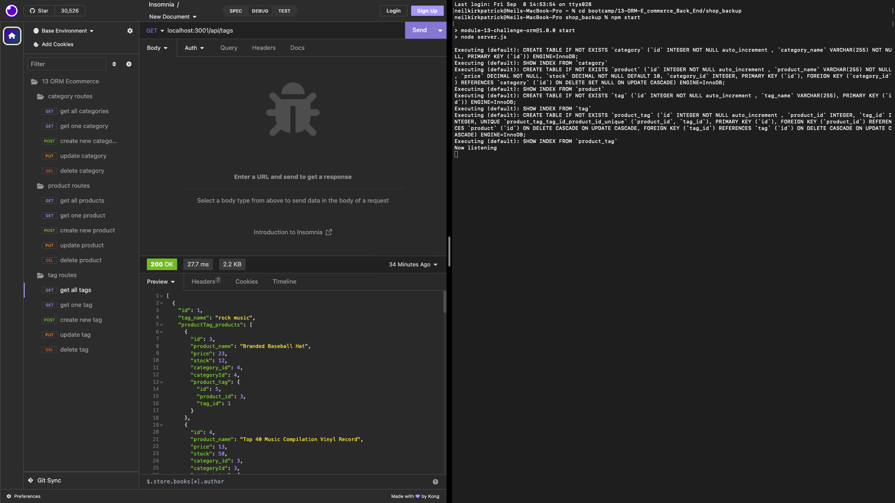

# E-commerce Back End

 

Check out the badges hosted by [shields.io](https://shields.io/).

## Description 

*What, why, and how:* 

This is a back end for an e-commerce site. E-commerce has become the largest sector of the electronics industry. Because of this, as a full-stack web developer, I wanted to become familiar with the architecture of these platforms. It includes an Express.js API and uses Sequelize to interact with a MySQL database.

## Table of Contents
* [Installation](#installation)
* [Usage](#usage)
* [Resources/Credit](#resourcescredit)
* [License](#license)

## Installation

*Instructions on how to install project and to get the development environment running:*

- Clone the repo to your local device.
- Run `npm i` in your CLI at the root of the project.

## Usage 

*Instructions and examples for use:*

- `myssql -u root p`
- Enter your password when prompted
- `source db/schema.sql`
- `exit`
- `npm run seed`
- `npm start`

Usage video link: https://watch.screencastify.com/v/tGnjERs3rTCRC10wlkza 

## Resources/Credit

- Starter code provided by UCB Extension Bootcamp
- UCB Instructors and TA's
  - Kayvon

## License

MIT License

---

## Questions?

For any questions, please contact me with the information below:

GitHub: [@neilmkflyingk](https://api.github.com/users/neilmkflyingk)
